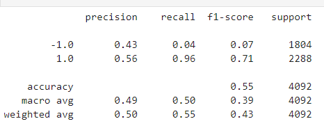
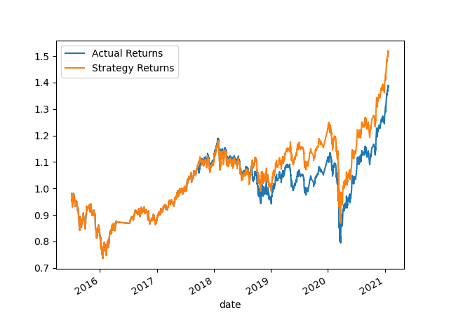
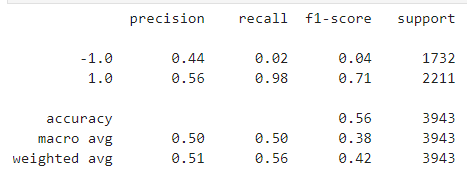
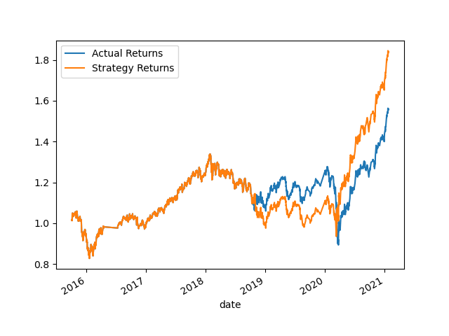
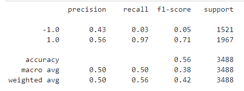
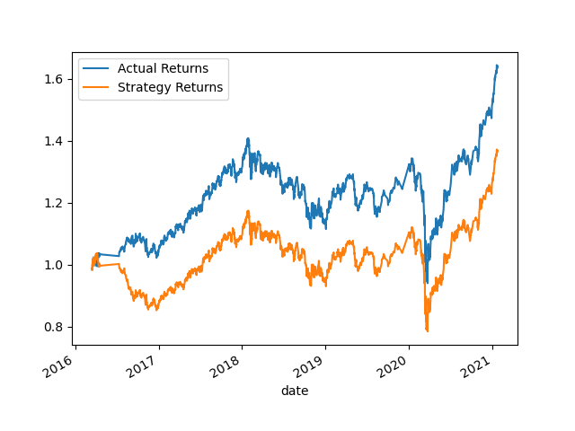
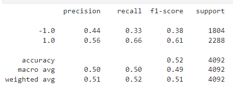
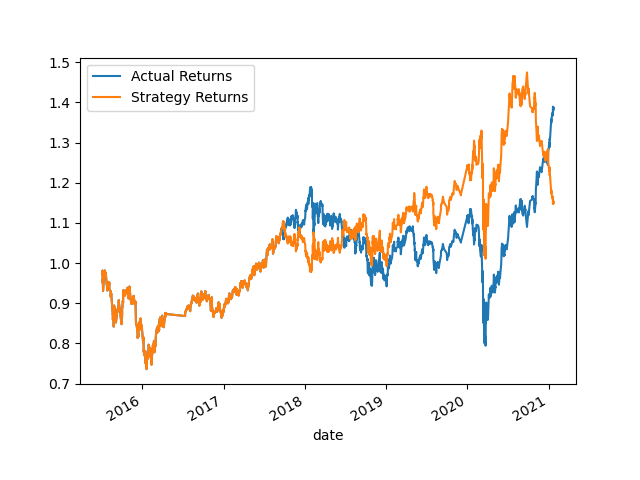

# Algorithmic_Trading_Mod14
Machine Learning Trading Bot

## Baseline

Parameters:

    * short_window = 4
    * long_window = 100
    * buy long strategy = 1
    * sell short strategy = -1
    * dateoffset: months=3

Classification Report: 

The baseline model reflects an accuracy score of 55%.  

However, when looking at the “signal of 1”, which is the buying long strategy, the model has a higher recall score of 96% versus a recall of 0.04% for the negative 1 (-1) class (short sale strategy).  Thus, illustrating that the model has a much higher probability to be able to predict correctly the buy long signal than it would the short sale signal.

Nevertheless, the direction of the strategy return does move similar in correlation with the actual returns and there are specific points between 2019 and 2021, where the strategy outperforms the actual returns.

## Revised - Adjustment - DateOffSet
____________________________________________________

Parameters: 
    * short_window = 4
    * long_window = 100
    * buy_long_strategy = 1
    * sell_short_strategy = -1
    * datefffset: months=6

Classification Report: 

In this model, we keep all other variables constant, but increased the dateoffset equal to 6 months.  The longer time horizon in the model yielded a slightly higher accuracy score of 56%, versus the baseline of 55%.  However, most notably, the recall of 98% also increased as well indicating a much better score of predicting the long buy position.  The short sell position recall decreased to 0.02%,. This translate to If any investor were to look at holding a long position, the strategy would work out much better, than an investor who is looking to short sell this security.  

## SMA Revisions
_______________________________________________________

Parameters: 
    * short_window = 2
    * long_window = 180
    * buy long strategy = 1
    * sell short strategy = -1
    * dateoffset: months=6

Classification Report:

In this revision, the model lowered the short_window to 2 days and extended the long window to 180 days.  While there was a slight better performance than the baseline on predicting the short window and long window, the improvement was not significant.  

Nevetheless, all three of those models does reflect a consensus towards better prediction of long buy and likely to be used on a long buy strategy, as the margin for error for short sale strategy is too large to employ, unless the investor is alright with taking a much higher risk tolerance with not much in upside potential when weighing out the risk factors. 

# ML Classifier = Logistic Regression Backtesting With Testing Data
_______________________________________________________

When backtesting the model with Logistic Regression, the accuracy score dropped to 52% as compared to the baseline of 55%.  The recall score of the long position also dropped sizably to 66%.  Conversely, the short sale positioned improved to 33%, thereby, indicating a much stronger model for an short sale investor.  The model is still better prepositioned into predicting long buy strategies versus short sale strategies.  There is a smaller window of when the strategy returns actually outperform the actual returns, which would be between 2019 and before the end of 2020. As the model approaches 2021, there is point in which the strategy returns actually fall below actual returns.  In the backtesting logistics regression model, it was the only model where the strategy returns moved inversely with the actual returns after the 2021 year.  Therefore, this model would not have worked retrospectively when using historical data to validate the accuracy of the strategy.  

Classification Report: 

